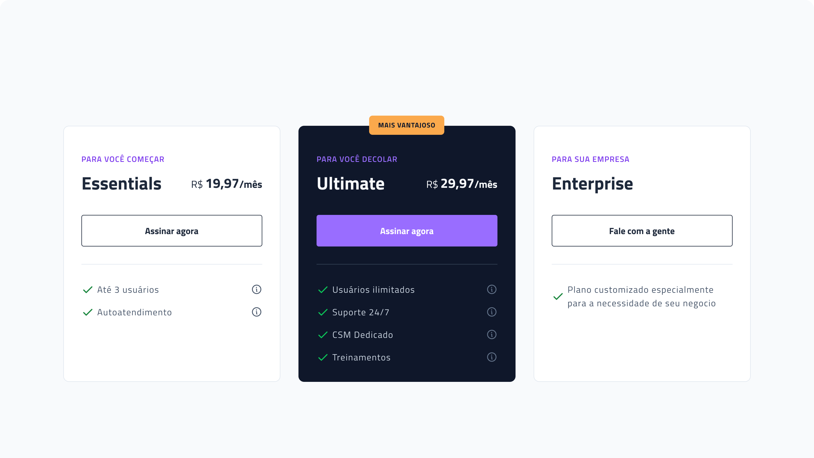

<h1 align="center"> Pricing table </h1>

  

    Este é um projeto criado como parte do Desafio #15 proposto pelo #boracordar da Rocketseat. O objetivo do desafio era criar uma tabela de preços (pricing table) para um produto ou serviço fictício.
  

  

    A tabela de preços foi desenvolvida de forma a apresentar de maneira clara e objetiva as opções disponíveis, seus preços e as funcionalidades de cada uma. Além disso, foi aplicado um design moderno e atraente, utilizando CSS para estilização da tabela.

  

  <a href="#-tecnologias">Tecnologias</a>&nbsp;&nbsp;&nbsp;|&nbsp;&nbsp;&nbsp;
  <a href="#-layout">Layout</a>&nbsp;&nbsp;&nbsp;|&nbsp;&nbsp;&nbsp;
  <a href="#memo-licença">Licença</a>

  

 

  

## 🚀 Tecnologias

Esse projeto foi desenvolvido com as seguintes tecnologias:

-  HTM e CSS
-  Figma
-  Google Fonts

## 🔖 Layout

Você pode visualizar o layout do projeto através [DESSE LINK](https://www.figma.com/community/file/1227809985897425342). É necessário ter conta no [Figma](https://figma.com) para acessá-lo.

## :memo: Licença

Esse projeto está sob a licença MIT.

---

Feito com ♥ by Vitor Lucas :wave: [Participe da comunidade da Rocketseat!](https://discord.gg/rocketseat)
